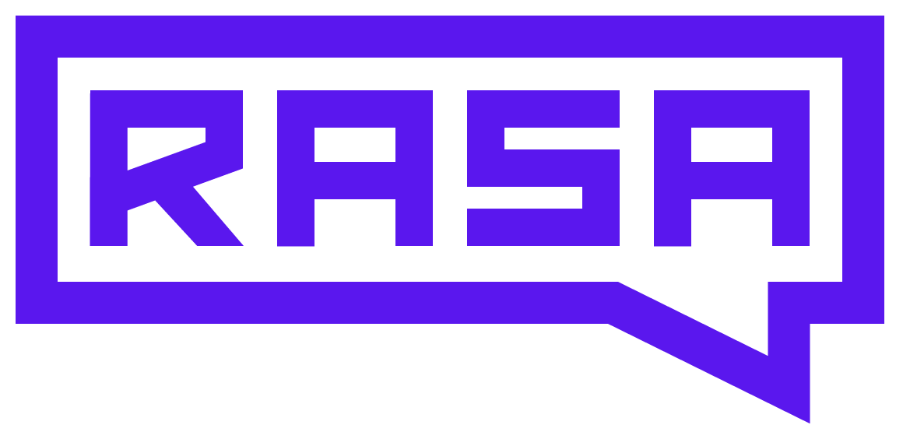
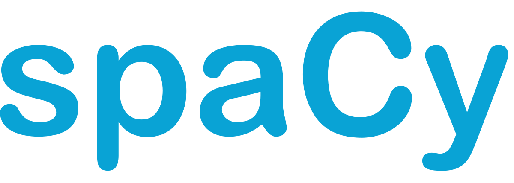

  

## What's BlessBoks?
- BlessBoks, a chat bot, provides practical advice and solutions to help resolve workplace issues such as conflict and employee dissatisfaction. She can help you and your team: Focus on work and become productive again, regain energy and enthusiasm, improve engagement and communication, reduce feelings of discomfort and stress & minimise organisational and personal risk

## Why BlessBoks?
- BlessBoks uses [TKI model](https://en.wikipedia.org/wiki/Thomas%E2%80%93Kilmann_Conflict_Mode_Instrument) to resolve any conflict at your workplace. 

## Made With

  &nbsp;&nbsp;&nbsp;&nbsp;&nbsp;&nbsp;&nbsp;&nbsp;&nbsp;&nbsp;

